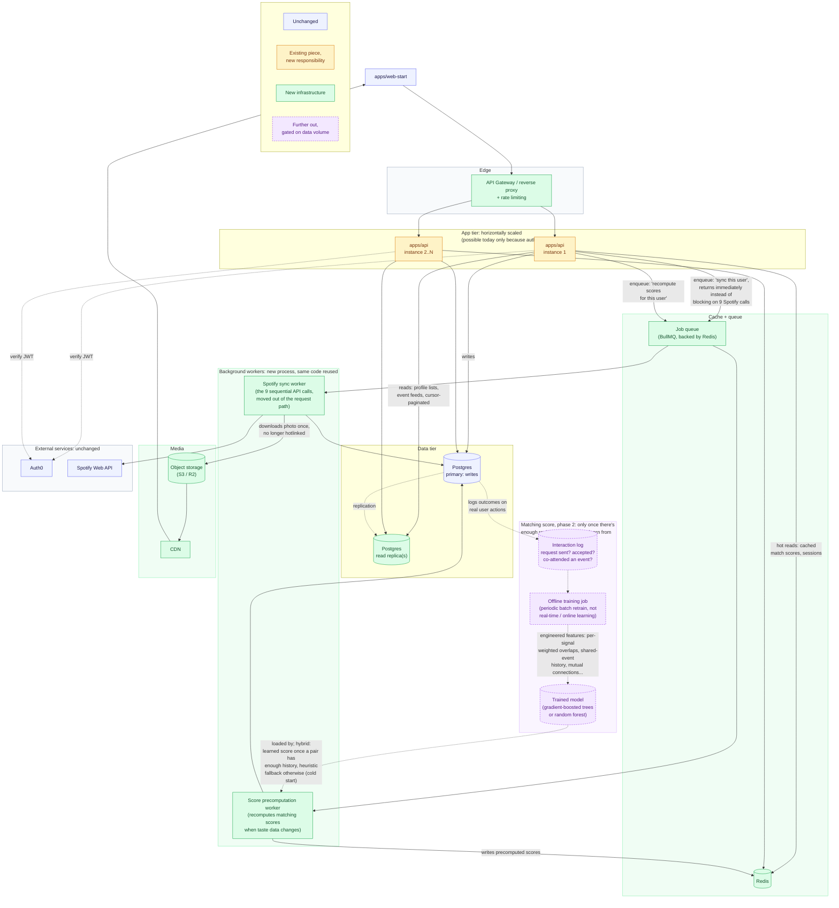

# SoundMate — Scaling Plan

This is the plan for scaling SoundMate past where it runs today: a few
hundred users on a single backend instance and a single Postgres database.
Nothing on this page is built yet. It exists so the plan is documented
before it's actually needed, and so "how would this scale" has a real
answer instead of a guess made up on the spot. For the current, as-built
architecture, see [`README.md`](./README.md).

## What changes, and what doesn't

This diagram shows the same system as README.md's diagrams, after the
fixes from a system-design review, colored so it is obvious at a glance
what's untouched, what's an existing piece with new responsibilities, and
what's genuinely new infrastructure.

This diagram is not what is running today, it is the plan for when the app
needs to grow past a few hundred users. The blue pieces stay exactly as they
are. The amber piece is the backend, still the same code, just run as
several copies behind a gateway instead of one instance. The green pieces
are genuinely new: a cache, a job queue, two background workers, a read
replica, and storage for images that we own instead of borrowing from
Spotify. The purple, dashed piece is further out still: a learned matching
model, and it only gets built once there is enough real user data to train
it on. Nothing here replaces what exists, it all gets added around it.

- **Blue (unchanged):** `apps/web-start`, Auth0, Spotify's API, and the
  Postgres primary all keep doing exactly what they do today.
- **Amber (existing, new responsibility):** `apps/api` doesn't change what
  it *is*, but two things change about how it's run. First, it's deployed as
  multiple stateless replicas behind a gateway instead of one instance,
  which, worth repeating, is only a small ops change because auth is
  already stateless. Second, the Spotify-callback and taste-profile
  endpoints stop doing slow work inline and instead just drop a message on
  the queue and return, which is a small code change, a queue client call
  replacing a direct function call, not a rewrite.
- **Green (new):** everything actually new, meaning the gateway (rate
  limiting), Redis (cache and queue backing store), the two background
  workers, the read replica, and object storage plus a CDN for images. This
  is genuinely additive infrastructure. It sits around the existing system
  rather than replacing pieces of it, which is why README.md's diagrams
  don't need to be thrown out, just extended.
- **Purple, dashed (further out):** the learned matching model. Dashed
  specifically because it's not "build this next," it's "build this once a
  precondition is met," explained below.

**What each new piece solves, mapped back to the specific problem:**

| New piece | Solves |
|---|---|
| API Gateway + rate limiting | Nothing currently protects endpoints from abuse or accidental traffic spikes eating Spotify's rate limit |
| Redis cache | Hot reads (precomputed match scores especially) currently hit Postgres every time, with nothing absorbing repeats |
| Job queue + Spotify sync worker | The OAuth callback currently blocks on 9 sequential Spotify calls before it can respond; one slow or failed call currently stalls the whole request |
| Score precomputation worker | `getFriendSuggestions` currently recomputes every pairwise score live, on every page load: O(N) per request, O(N²) system-wide |
| Postgres read replica | Read-heavy pages (Discover, event feeds) currently compete with writes for the same database connections |
| Object storage + CDN | Profile photos currently hotlink Spotify's CDN directly, which is why the "stale URL" bug happened at all; the app owns none of its own image availability |
| Learned matching model | The current score is a fixed, hand-tuned formula (0.4/0.3/0.2/0.1 weights). It can't improve from real outcomes, and it can't tell you which signal actually predicts a good match |

## Further out: replacing the hand-tuned formula with a learned model

This is the piece worth explaining carefully if asked "could you use ML for
the matching score." Yes, but it's gated on something the app doesn't have
yet, and that gate matters more than the model choice.

**What would change.** Right now `calculateCompatibilityScore` is a fixed
formula. Someone decided artists matter 40%, genres 30%, and so on, and
those weights never move no matter what actually happens after a match. A
**supervised learning** approach replaces that fixed formula with a model
trained on real outcomes: instead of *guessing* the weights, you *learn*
them from data about which matches actually led somewhere.

**Why a tree model specifically (gradient-boosted trees, e.g. XGBoost or
LightGBM, or a random forest as the simpler first cut) fits this problem
well:**
- The inputs are exactly the kind of data trees are good at: a handful of
  numeric features per pair (artist overlap, genre overlap, song overlap,
  listening-pattern similarity, and more granular ones you could add, such
  as mutual-connections count or recency of shared listening). Trees don't
  require the features to be scaled or linearly related to the outcome the
  way something like logistic regression would.
- **Feature importance falls out of the model almost for free.** Once
  trained, you can ask it "which of these signals actually predicted a real
  connection" and get a ranked answer. That's strictly more information
  than the current setup gives you: right now the 0.4/0.3/0.2/0.1 weights
  are an educated guess, while a trained model would tell you if, say,
  shared genres actually matter more than the current weighting assumes.
  That's a product insight, not just a scoring mechanism.
- Random forest is the safer starting point specifically because it's
  harder to overfit with a smaller dataset than gradient boosting is.
  Graduating to gradient-boosted trees is a reasonable next step once
  there's more data to train on, not a decision to make upfront.

**The actual blocker: there's no labeled data yet.** A supervised model
needs examples of the outcome you're trying to predict, something like "did
this suggested match turn into a real connection." Nothing in the app
currently records that. Before any model can be trained, the app needs to
start logging **implicit feedback** as an interaction log: was a connection
request sent from a suggestion, was it accepted, did the two users later
co-attend an event together. Those become the training labels. This is the
actual first step, and it's mostly instrumentation, not modeling.

**Why this is explicitly gated, not just "next on the roadmap":** with only
a few hundred users and a thin interaction history, training a tree
ensemble would almost certainly **overfit**. It would fit noise in a small
dataset and likely perform *worse* than the current hand-tuned heuristic,
which at least generalizes by construction. The honest engineering call is
to wait until there's a meaningful volume of labeled interactions (low
thousands, roughly) before training anything, and to keep improving the
heuristic in the meantime.

**Two production-ML patterns worth naming, since they'd both apply here:**
- **The cold-start problem, and a hybrid fallback.** A brand-new user, or
  any pair with little shared interaction history, has no signal for a
  learned model to work from. The realistic design isn't "replace the
  heuristic," it's "use the learned model's score once a pair has enough
  history behind it, and keep the current heuristic as the fallback for
  everyone else," the same kind of hybrid pattern most real recommender
  systems use, not a hard cutover.
- **Shadow mode, also called champion-challenger.** Even once a model is
  trained, the safe rollout isn't "swap the scoring function and hope."
  Instead, compute both scores, show users the current heuristic's result,
  but log what the new model *would have* said, and compare against real
  outcomes for a while. Only promote the model to being the one users
  actually see once it's measurably beating the heuristic on real data, not
  before.

The diagram shows this as a self-contained addition specifically because
none of it touches the score-precomputation worker's existing
responsibility. The worker's job stays "produce a score for this pair," it
would just optionally consult a trained model instead of the fixed formula
when one is available and confident enough, which is why this can be added
later without a redesign of anything already planned above it.
