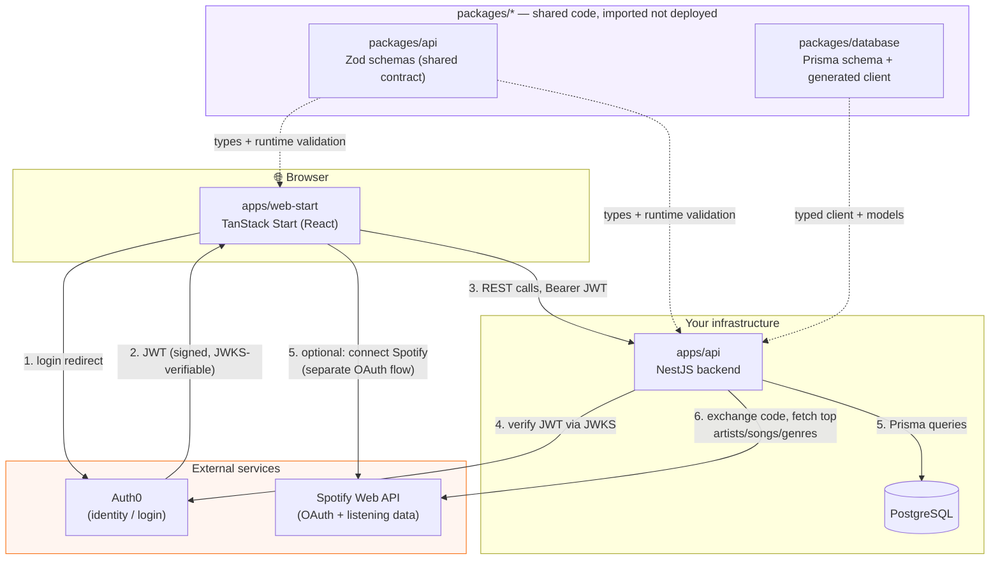
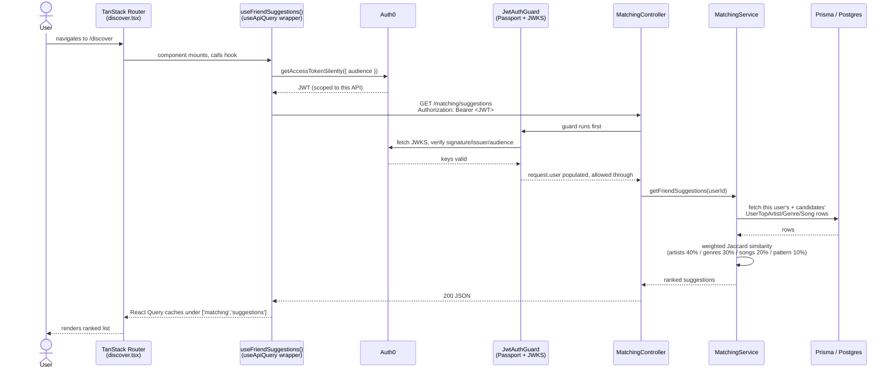
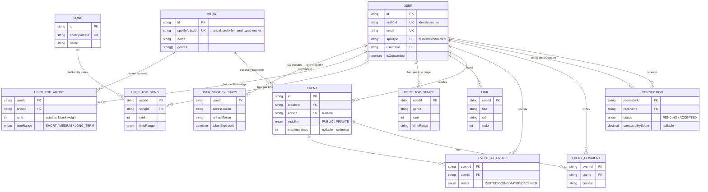
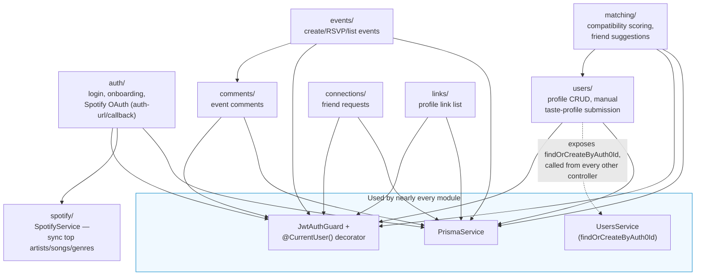
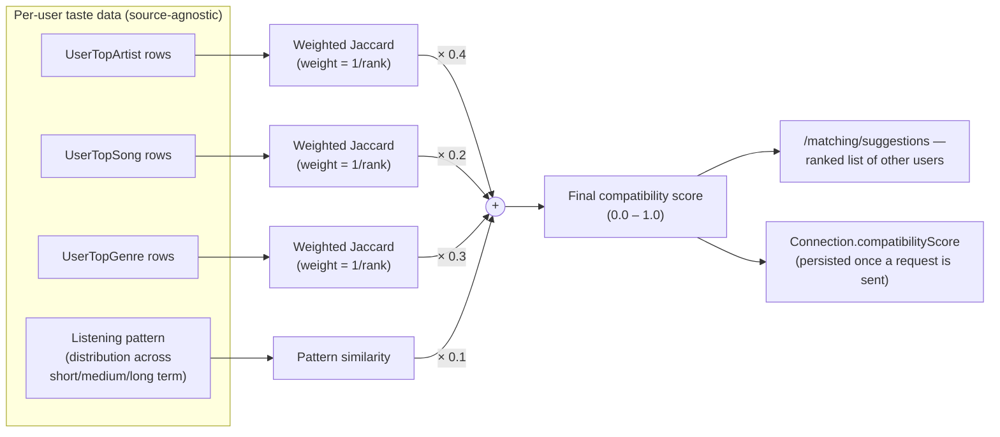
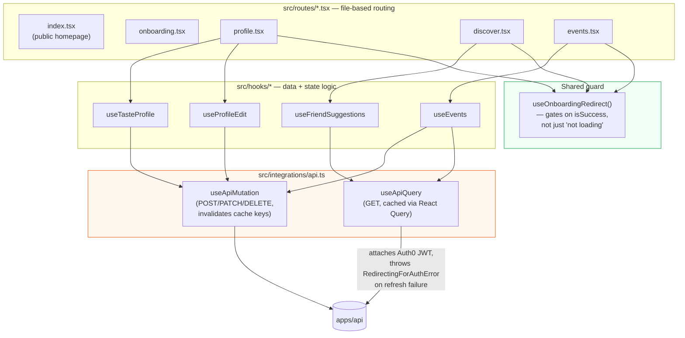
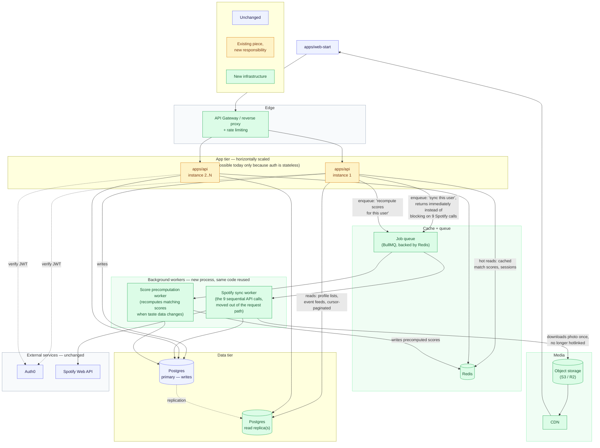

# SoundMate Visual Architecture Map

## 1. High level system overview

## 2. End to end request life cycle

## 3. Spotify Integration

```mermaid
flowchart LR
    Start(["User clicks<br/>Log in / Sign up"]) --> Gate{"SpotifyGateModal:<br/>continue with Spotify,<br/>or without it?"}

    Gate -- "With Spotify" --> A0Spotify["Auth0 login,<br/>connection = spotify"]
    Gate -- "Without Spotify" --> A0Pwd["Auth0 login,<br/>connection = Username-Password"]

    A0Spotify --> JWT1["JWT issued"]
    A0Pwd --> JWT2["JWT issued"]

    JWT1 --> App["Logged into the app.<br/>isOnboarded? no → /onboarding"]
    JWT2 --> App

    App --> Onboard["Fill in username/displayName/bio"]
    Onboard --> Choice{"Build taste profile how?"}

    Choice -- "Connect Spotify for real" --> Direct["/auth/spotify/auth-url\n(backend-owned OAuth,\nseparate from Auth0 entirely)"]
    Choice -- "Type it in by hand" --> Manual["TasteProfileForm →\nPOST /users/me/taste-profile"]

    Direct --> Callback["/auth/spotify/callback\n(public route — see state-signing below)"]
    Callback --> Sync["syncTopArtists / syncTopSongs / syncTopGenres"]
    Manual --> Resolve["Case-insensitive match against\nexisting Artist rows, or create new"]

    Sync --> Tables[("UserTopArtist /\nUserTopSong /\nUserTopGenre")]
    Resolve --> Tables

    Tables --> Match["Matching algorithm —\ndoesn't know or care which\npath the data came from"]

    style Gate fill:#eef,stroke:#556
    style Choice fill:#eef,stroke:#556
    style Callback fill:#fee,stroke:#c33
```

## 4. Database schema (Prisma models Postgres)

Every relation below is a real foreign key in `packages/database/prisma/schema.prisma`.

## 5. Backend module map

Every feature folder in `apps/api/src` follows the same
Module -> Controller -> Service shape

## 6. Matching algorithm data flow

## 7. Frontend: routes, hooks, and where auth is enforced

## 8. The scaling plan — what changes, and what doesn't

Diagrams 1–7 show the system as it exists today. This one shows the same
system **after** the fixes from the system-design review, colored so it's
obvious at a glance what's untouched, what's an existing piece with new
responsibilities, and what's genuinely new infrastructure. 

- **Blue (unchanged)** — `apps/web-start`, Auth0, Spotify's API, and the
  Postgres primary all keep doing exactly what they do today. 
- **Amber (existing, new responsibility)** — `apps/api` doesn't change what
  it *is*, but two things change about how it's run: (1) it's deployed as
  multiple stateless replicas behind a gateway instead of one instance,
  which — worth repeating — is only a small ops change *because* auth was
  already stateless (see diagram-1 discussion); (2) the Spotify-callback and
  taste-profile endpoints stop doing slow work inline and instead just drop
  a message on the queue and return, which is a small code change (a queue
  client call replacing a direct function call), not a rewrite.
- **Green (new)** — everything actually new: the gateway (rate limiting),
  Redis (cache + queue backing store), the two background workers, the read
  replica, and object storage + CDN for images. This is genuinely additive
  infrastructure — it sits *around* the existing system rather than
  replacing pieces of it, which is why the diagram from section 1 doesn't
  need to be thrown out, just extended.

**What each new piece solves, mapped back to the specific problem:**

| New piece | Solves |
|---|---|
| API Gateway + rate limiting | Nothing currently protects endpoints from abuse or accidental traffic spikes eating Spotify's rate limit |
| Redis cache | Hot reads (precomputed match scores especially) currently hit Postgres every time, with nothing absorbing repeats |
| Job queue + Spotify sync worker | The OAuth callback currently blocks on 9 sequential Spotify calls before it can respond; one slow/failed call currently stalls the whole request |
| Score precomputation worker | `getFriendSuggestions` currently recomputes every pairwise score live, on every page load — O(N) per request, O(N²) system-wide |
| Postgres read replica | Read-heavy pages (Discover, event feeds) currently compete with writes for the same database connections |
| Object storage + CDN | Profile photos currently hotlink Spotify's CDN directly, which is why the "stale URL" bug happened at all — the app owns none of its own image availability |

