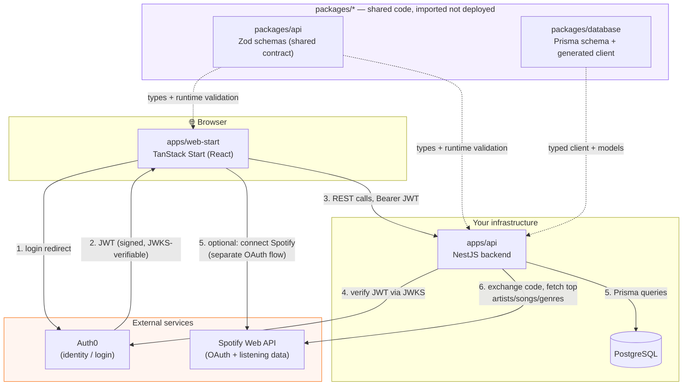
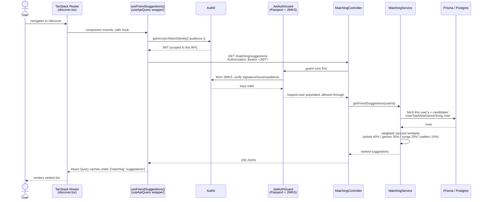
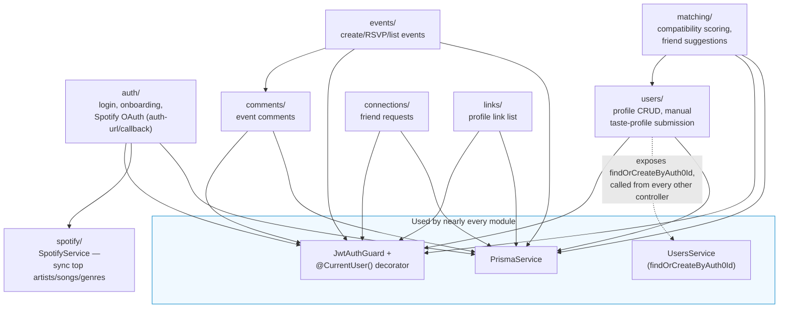
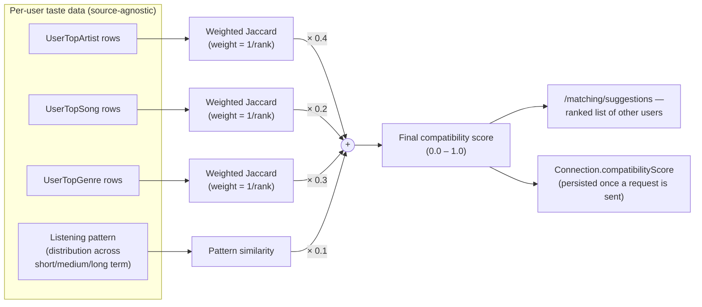
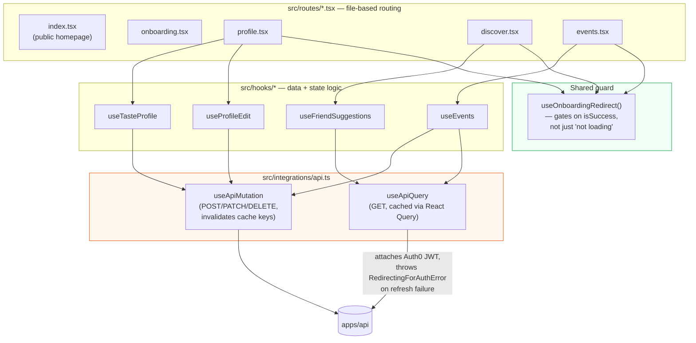

# SoundMate — Visual Architecture Map

Companion to [`ARCHITECTURE.md`](./ARCHITECTURE.md). That file explains things
in prose; this one is the same system as diagrams. Read them side by side —
each section here links back to the prose section that narrates it in depth.

GitHub renders all of these Mermaid blocks natively, just view this file on
github.com (or any Mermaid-aware Markdown viewer) rather than as raw text.

## 1. The whole system, one diagram

The monorepo, the two deployables, the external services they talk to, and
which shared packages feed which app.

**Why this shape:** identity (Auth0), taste data (Spotify → Postgres), and the
similarity logic that consumes it are kept as separate concerns on purpose —
see "What the app actually does" in `ARCHITECTURE.md`.

## 2. A single request, end to end

"A logged-in user opens the Discover page" — the seven-step lifecycle from
`ARCHITECTURE.md`, as a sequence diagram instead of a numbered list.

## 3. Two Spotify flows, side by side

The single most important architectural decision in this codebase: **login**
and **linking your Spotify data** are two unrelated flows. Conflating them is
the mistake that made Spotify's dev-mode tester cap block *all* logins, not
just Spotify-data-sync — see "Two Spotify integrations" in
`apps/api/ARCHITECTURE.md`.

**The security detail worth calling out on that "public route":** since
`/auth/spotify/callback` has to be reachable by Spotify's redirect (no bearer
token possible on a browser redirect), the only thing telling the backend
*which user* this callback is for is the `state` parameter. That value is now
HMAC-signed and TTL-bounded specifically because it used to be forgeable —
full writeup in `apps/api/ARCHITECTURE.md`'s security-review section.

## 4. Database schema (Prisma models → Postgres)

Every relation below is a real foreign key in `packages/database/prisma/schema.prisma`.

**The one deliberate omission:** notice `UserTopArtist`/`UserTopSong`/`UserTopGenre`
have no "source" column (Spotify vs. manual). That's not an oversight, it's
the whole reason the manual-taste-profile feature could be built without
touching the matching algorithm. See "Taste data is source-agnostic by
design" in `ARCHITECTURE.md`.

## 5. Backend module map

Every feature folder in `apps/api/src` follows the same
Module → Controller → Service shape (see `apps/api/ARCHITECTURE.md`,
"Anatomy of a feature"). This shows how the feature modules depend on each
other and on the two cross-cutting pieces every one of them uses.

## 6. Matching algorithm data flow

The math behind `MatchingService.calculateCompatibilityScore`, visualized —
prose walkthrough in `apps/api/ARCHITECTURE.md`, "The matching algorithm."

## 7. Frontend: routes, hooks, and where auth is enforced

`apps/web-start`'s file-based routes, the guard hook every protected page
shares, and the fetch layer every hook is built on — see
`apps/web-start/ARCHITECTURE.md` for the full narrative.

---

**How to use this file when relearning the project:** start at diagram 1 for
the 30,000-foot view, then 2 for how a request actually flows, then 3–4 for
the two hardest design decisions (dual Spotify flows, source-agnostic taste
data), then 5–7 if you need to point at *which file* implements a given box.
