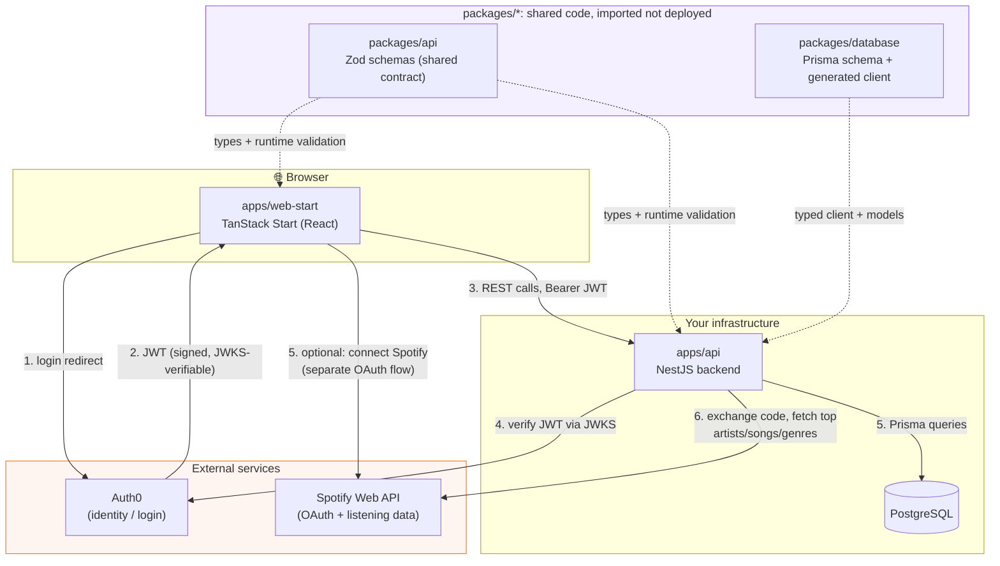
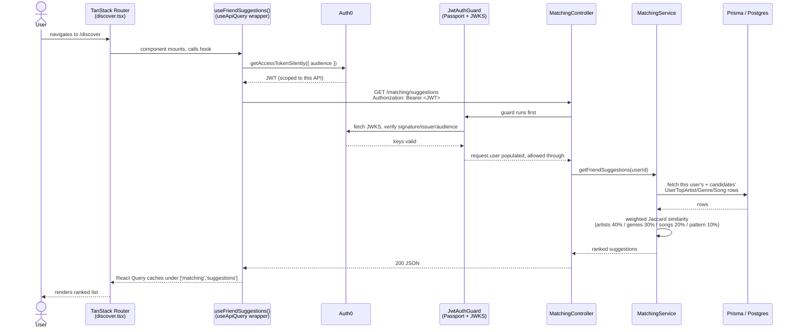
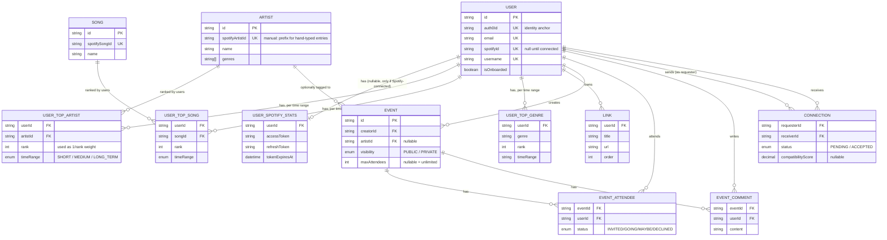
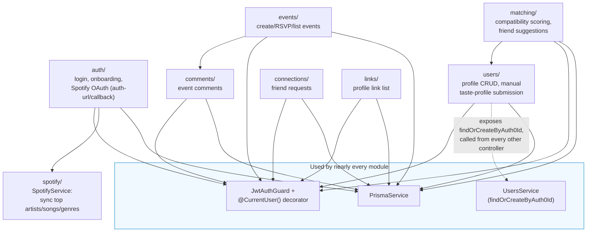
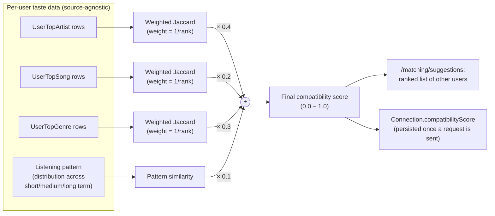
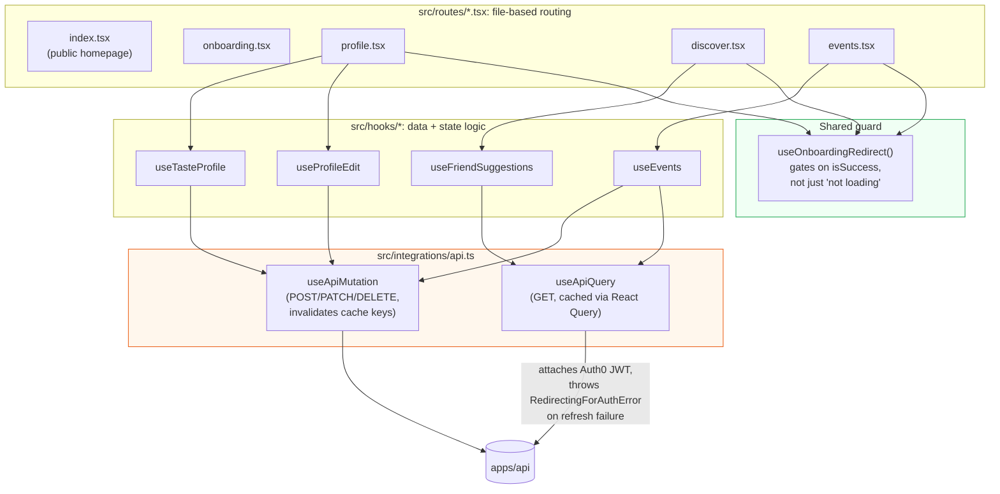

# SoundMate

## What is SoundMate

SoundMate is a social app built for college students who care about live
music. It connects to Spotify to learn what someone actually listens to,
then computes a compatibility score between students based on shared
artists, genres, songs, and listening habits. The idea is simple: finding
people to go to a concert with is usually harder than finding the concert
itself.

Beyond just showing a match, SoundMate lets students create and RSVP to
real events, whether that is a show, a listening party, or a jam session,
so a shared taste in music can turn into something people actually do
together. Spotify is optional. Anyone can build a taste profile by hand
instead, so the app still works for someone who uses a different platform
or who just does not want to connect an account.

## Architecture, visualized

The diagrams below walk through the system end to end: the overall
architecture, a single request from start to finish, how Spotify fits in,
the database, the backend's structure, the matching algorithm's math, and
the frontend. View this file on GitHub or any Mermaid-aware Markdown viewer
to render the diagrams.

### 1. High level system overview

The browser only ever talks to: Auth0 for login, and Spotify only if the user
chooses to connect it. Every other request goes to our own backend. Auth0
hands back a signed token after login, and that token rides along on every
request so the backend can confirm who is asking. The backend then talks to
Spotify to pull listening data, and to Postgres to read and store our own
data. The purple box on the right is shared code: one set of schemas that
both the frontend and backend import.

### 2. End to end request life cycle

When a user opens the Discover page: the frontend first asks Auth0 for a
token, then sends that token to our backend along with the request. A guard
checks the token is valid before anything else is allowed to run. Once it
passes, the controller asks the matching service for suggestions, the
service pulls each user's music data from Postgres, and runs the similarity
math on it. The result flows back up to the frontend, which caches it, so
the next time this user opens the page it can show instantly without asking
the server again.

### 3. Spotify Integration

```mermaid
flowchart LR
    Start(["User clicks<br/>Log in / Sign up"]) --> Gate{"SpotifyGateModal:<br/>continue with Spotify,<br/>or without it?"}

    Gate -- "With Spotify" --> A0Spotify["Auth0 login,<br/>connection = spotify"]
    Gate -- "Without Spotify" --> A0Pwd["Auth0 login,<br/>connection = Username-Password"]

    A0Spotify --> JWT1["JWT issued"]
    A0Pwd --> JWT2["JWT issued"]

    JWT1 --> App["Logged into the app.<br/>isOnboarded? no → /onboarding"]
    JWT2 --> App

    App --> Onboard["Fill in username/displayName/bio"]
    Onboard --> Choice{"Build taste profile how?"}

    Choice -- "Connect Spotify for real" --> Direct["/auth/spotify/auth-url\n(backend-owned OAuth,\nseparate from Auth0 entirely)"]
    Choice -- "Type it in by hand" --> Manual["TasteProfileForm →\nPOST /users/me/taste-profile"]

    Direct --> Callback["/auth/spotify/callback\n(public route, see state-signing below)"]
    Callback --> Sync["syncTopArtists / syncTopSongs / syncTopGenres"]
    Manual --> Resolve["Case-insensitive match against\nexisting Artist rows, or create new"]

    Sync --> Tables[("UserTopArtist /\nUserTopSong /\nUserTopGenre")]
    Resolve --> Tables

    Tables --> Match["Matching algorithm:\ndoesn't know or care which\npath the data came from"]

    style Gate fill:#eef,stroke:#556
    style Choice fill:#eef,stroke:#556
    style Callback fill:#fee,stroke:#c33
```

This shows the two separate paths a user can take through Spotify, which is
the most important design decision in this project. Logging in and
connecting Spotify are not the same thing. A user can log in with just an
email and password, then later choose to either connect Spotify for real or
type in their favorite artists by hand. Both paths end up writing to the
exact same database tables, so the matching algorithm never needs to know
which one a given user took. This split is also what let people demo the
app without needing Spotify's manual approval, since login no longer
depends on Spotify at all.

### 4. Database schema (Prisma models Postgres)

Every relation below is a real foreign key in `packages/database/prisma/schema.prisma`.

This is the full data model. A user can have one Spotify connection, and
many top artists, songs, and genres, each tied to a time range like short
term or long term. Artists and songs are their own tables, shared across all
users, so two people who both like the same artist point to the same row
instead of two separate copies of it. Events, comments, and connections all
link back to users the same way, through simple foreign keys. Notice there
is no column anywhere saying whether a row came from Spotify or was typed in
by hand. That is on purpose, and it is why the two paths shown in diagram 3
could share the same matching logic without any special casing.

### 5. Backend module map

Every feature folder in `apps/api/src` follows the same
Module -> Controller -> Service shape

Every feature in the backend lives in its own folder with the same shape,
whether it is events, comments, connections, or anything else. All of them
share three things: the database service, the login guard, and a helper
that finds or creates a user's own record. That shared helper is called from
almost every controller, so a fix or a change to how a user gets created
only has to happen in one place instead of being copied everywhere.

### 6. Matching algorithm data flow

This is the actual math behind the compatibility score. For each of
artists, songs, and genres, we compare two users' ranked lists and measure
how much they overlap, weighted so that a shared favorite counts for more
than a shared item buried near the bottom of the list. Those three
overlap scores, plus a fourth one for listening pattern, get combined using
fixed weights into one final number between zero and one. That number is
what powers the ranked suggestions list, and it gets saved permanently once
two users actually connect.

### 7. Frontend: routes, hooks, and where auth is enforced

On the frontend, each page is its own file, and any page that needs a
completed profile shares one guard hook that redirects to onboarding if the
user has not finished setting one up. Pages never fetch data directly.
Instead they call a hook, like useEvents or useFriendSuggestions, and every
one of those hooks goes through the same two wrapper functions that handle
attaching the login token and caching the response. That means adding a new
feature almost never means writing new fetching logic from scratch, it
means writing one small hook that reuses the same plumbing everything else
already uses.

## Scaling plan

SoundMate runs today on a single backend instance and a single Postgres
database, which is enough for where it is right now. There is a plan for
what changes once that stops being true: a new cache layer, a job queue,
background workers, a read replica, and further out, a learned matching
model. To see the scaling plan, [click here](./ARCHITECTURE.md).
